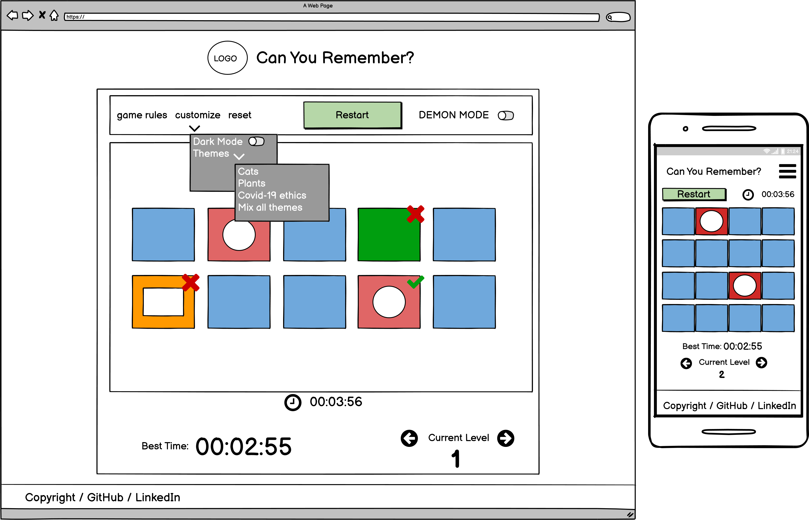
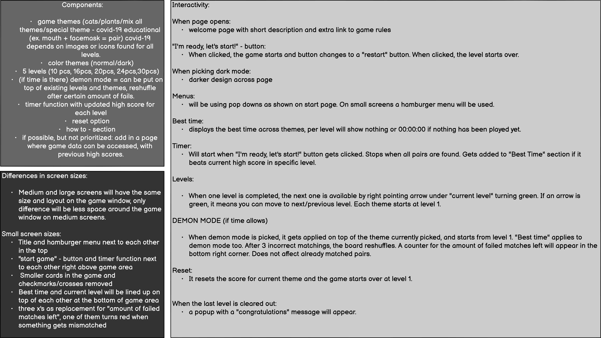

<!-- PROJECT LOGO -->
*work in progress*

<br />
<p align="center">
  <a href="#">
    
  </a>

  <h3 align="center">Can You Remember?</h3>

  <p align="center">
    A simple interactive memory game for Code Institute's second Milestone Project.
    <br />
    <a href="#"><strong>Quick link to the website</strong></a>
    <br />
    <br />
    <a href="https://github.com/JuliaByl">Github Pages</a>
    ·
    <a href="#">LinkedIn</a>
    ·
    <a href="#contact">Contact</a>
  </p>
</p>


<!-- TABLE OF CONTENTS -->
<details open="open">
  <summary>Table of Contents</summary>
  <ol>
    <li>
      <a href="#about-the-project">About The Project</a>
      <ul>
        <li><a href="#built-with">Built With</a></li>
        <li><a href="#how-to-clone-my-repository">How to clone my repository</a></li>
      </ul>
    </li>
    <li><a href="#usage">Usage</a></li>
    <li>
        <a href="#roadmap">Roadmap</a>
        <ul>
            <li><a href="#bugs">Bugs</a></li>
            <li><a href="#bigger-changes-to-the-website">Bigger changes to the website</a></li>
            <li><a href="#testing">Testing</a></li>
        </ul>
    </li>
    <li><a href="#contributing">Contributing</a></li>
    <li><a href="#license">License</a></li>
    <li><a href="#contact">Contact</a></li>
    <li><a href="#acknowledgements">Acknowledgements</a></li>
  </ol>
</details>


<!-- ABOUT THE PROJECT -->
## About The Project


This Is a simple memory game, inspirated by the current worldwide events. It will be designed in a way that is pleasing to the eye, and challenging to the mind. It also takes into consideration the importance of staying safe during covid-19, and will have a special theme dedicated to educate about protecting yourself and others. It is a multi level game with different themes, and a special level for those who want more of a challenge. 

Below this text I have attached two wireframe examples of the website, one with an in-game example, and the other one is a more complete description of the components of the game. 
To see complete wireframes, click [**HERE**](images/wireframes/complete-wireframes.png).
<hr>

<!-- HERO IMAGE / EXAMPLE WIREFRAME -->





### Built With

* [Bootstrap](https://getbootstrap.com)
* [JQuery](https://jquery.com)


### How to Clone my repository

1. Get a free API Key at [https://example.com](https://example.com)
2. Clone the repo
   ```sh
   git clone https://github.com/your_username_/Project-Name.git
   ```
3. Install NPM packages
   ```sh
   npm install
   ```
4. Enter your API in `config.js`
   ```JS
   const API_KEY = 'ENTER YOUR API';
   ```


<!-- USAGE EXAMPLES -->
## Usage

### User Stories

As a user I want to...

* ...feel motivated to stay in the game - by getting challenged and having multiple choices to pick between
* ...be able to stay in the game for longer without straining my eyes - by having the possibility to choose dark mode
* ...learn something - by getting a useful theme focused on learning about current events
* ...navigate easily throughout the game - by having everything easily accessible and instructions to not cause confusion


<!-- ROADMAP -->
## Roadmap


### Bugs

[Link to github issues section](https://github.com/JuliaByl/can-you-remember/issues)

### Bigger changes to the website
*to be added*

### Testing
*to be added*

<!-- CONTRIBUTING -->
## Contributing

Contributions are what make the open source community such an amazing place to be learn, inspire, and create. Any contributions you make are **greatly appreciated**.

1. Fork the Project
2. Create your Feature Branch (`git checkout -b feature/AmazingFeature`)
3. Commit your Changes (`git commit -m 'Add some AmazingFeature'`)
4. Push to the Branch (`git push origin feature/AmazingFeature`)
5. Open a Pull Request


<!-- LICENSE -->
## License

Distributed under the MIT License. See `LICENSE` for more information.


<!-- CONTACT -->
## Contact

Julia Bylund - julia.bylund.97@gmail.com

Project Link: [Can You Remember?](https://github.com/JuliaByl/can-you-remember)


<!-- ACKNOWLEDGEMENTS -->
## Acknowledgements
* [Code Institute](https://codeinstitute.net/)
* [README template from othneildrew](https://github.com/othneildrew/Best-README-Template)
* [GitHub Pages](https://pages.github.com)
* [Font Awesome](https://fontawesome.com)
* [Balsamiq Wireframes](https://balsamiq.com/)
* [Pexels](https://www.pexels.com/)
* [Google Fonts](https://fonts.google.com/)
* [Stack Overflow](https://stackoverflow.com/)